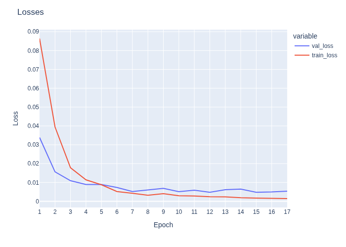
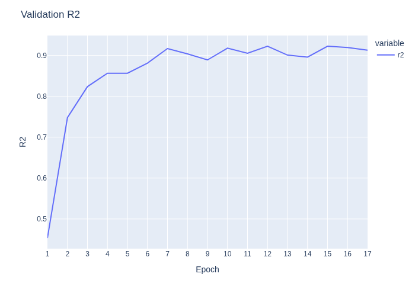
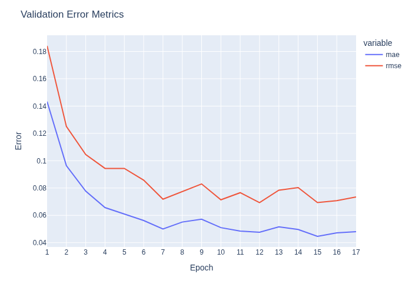

# 🧠 SAFE-6G Cognitive Coordinator (CoCo)

The **Cognitive Coordinator (CoCo)** is the AI-native trust orchestrator at the heart of the **SAFE-6G architecture**. It interprets user trust intents expressed in natural language and translates them into actionable system configurations, dynamically computing a **Level of Trustworthiness (LoT)** that aligns with both semantic intent and real-world resource constraints.


## ✅ Key Features

- Fine-tuned **BERT regressor** with five output heads, one per Trust Function (TF)
- Fully interpretable scoring pipeline with **semantic weighting**
- **Calibrated trust scoring** based on available system resources
- FastAPI-based HTTP interface for input submission and LoT computation
- **Dockerized** deployment for seamless integration into SAFE-6G testbed environments
- Plug-and-play design with message broker, monitoring, and orchestrator compatibility

## 🧮 Trustworthiness Model

### 1. 🔎 Trust Function Weighting

Let $n_{TF_j}$ be the number of user input expressions mapped to trust function $TF_j$. A logarithmic smoothing function assigns importance weights:

$$
W_{TF_j} = \frac{\log(1 + n_{TF_j})}{\sum_{k=1}^{5} \log(1 + n_{TF_k})}
$$

---

### 2. 📊 Non-Calibrated Level of Trustworthiness (nLoTW)

Given BERT-predicted scores $REG_{TF_j} \in [0, 100]$, the initial semantic-level trust score is:

$$
nLoTW = \left( \frac{\sum_{j=1}^{5} W_{TF_j} \cdot REG_{TF_j}}{\sum_{j=1}^{5} W_{TF_j}} \right) \cdot 100
$$

---

### 3. 🧠 Calibrated Level of Trustworthiness (cLoTW)

Each TF has a maximum enforceable capacity $TFcap_j \in [0, 100]$. The calibrated score is:

$$
V_j = \min(W_{TF_j} \cdot REG_{TF_j}, TFcap_j)
$$

$$
cLoTW = \left( \frac{\sum_{j=1}^{5} V_j}{\sum_{j=1}^{5} V_j} \right) \cdot 100
$$

## 📊 BERT-Based Trust Quantification

This BERT-based regression model estimates trustworthiness scores $[0, 100]$ for user-provided textual expressions across five trust dimensions: **Reliability**, **Privacy**, **Security**, **Safety**, and **Resilience**. Each trust function is assigned a dedicated regression head on top of a shared BERT encoder.

### Model Architecture

* **Base encoder**: `bert-base-uncased` from HuggingFace Transformers.
* **Output heads**: Five parallel `nn.Linear` regressors (one per trust class).
* **Input**: Natural language expressions + class label.
* **Output**: Continuous trustworthiness score per expression.

### Training Overview

* **Dataset**: Expert-annotated expressions with associated trust scores.
* **Loss function**: Mean Squared Error (MSE).
* **Training schedule**: 500 epochs with early stopping.
* **Data split**: 70% training / 15% validation / 15% test (same indices used as in baseline).

---

### Training Results

**Epoch-wise Losses**

Training and validation losses decreased consistently over time, indicating stable convergence without overfitting.



**R² Score Evolution**

Validation R² improves steadily, reaching >0.9, confirming good predictive capability on unseen data.



**Error Metrics (MAE & RMSE)**

Both MAE and RMSE show a decreasing trend, reflecting error reduction during training.



**Best Validation Metrics**

| Metric        | Value         |
| --------------| ------------- |
| MSE/Val Loss  | 0.004798      |
| MAE           | 0.0476        |
| RMSE          | 0.069267      |
| R² Score      | 0.922622      |
| Epoch         | 12            |

These were recorded at the epoch with **lowest validation loss**.

---

**Final Test Set Performance**

| Metric   | Value          |
| -------- | -------------  |
| MAE      | 0.048383       |
| RMSE     | 0.062127       |
| R² Score | 0.935158       |

Test results confirm generalization to unseen data and validate the trustworthiness of BERT-based quantification.

## 🚀 Getting Started

### Environment Setup with Rye

We use [**rye**](https://rye-up.com) for Python environment management.

#### Prerequisites

Ensure `rye` is installed:

```bash
curl -sSf https://rye-up.com/get | bash
source ~/.bashrc  # or ~/.zshrc
```

#### Install All Dependencies

```bash
rye sync  # installs from pyproject.toml
```

### Train Trust Quantification Models

Run end-to-end experiments using one of the following scripts:

`src/coco/experiments/train_baseline.py`

**OR**

`src/coco/experiments/train_bert.py`

Alternatively, check the worflow on the notebook: `notebooks/ML_Models.ipynb`. This process described in the following sections:

#### Configuration Import

```python
from coco.config.config import REGISTRY_DIR
```

This path (`REGISTRY_DIR`) controls where model weights and metrics are stored (e.g., `model_registry/bert_model.pth`, `metrics.json`).

#### Run the Baseline Experiment

```python
from coco.experiments.train_baseline import run as run_baseline
run_baseline()
```

* **Model**: TF-IDF + Gradient Boosting Regression
* **Usage**: Establishes a simple ML benchmark

#### Run the BERT-Based Experiment

```python
from coco.experiments.train_bert import run as run_bert
run_bert()
```

* **Model**: `bert-base-uncased` + 5 regression heads
* **Trainer**: Early stopping, augmentation, evaluation logging

### Model Artifacts

After training, models and logs are stored in:

```
model_registry/
├── best_model.pth         # Saved BERT checkpoint
├── metrics.json           # All training/validation/test metrics
```

### Evaluation & Inference

You can run inference from the notebook or script:

```python
from coco.inference.bert_inference import InferenceHandler

inf_h = InferenceHandler(model_weights_path=os.path.join(REGISTRY_DIR, "best_model.pth"))
inf_h.inference("Respect user data", "Privacy")
```

## CoCo Usage

### Run the System

Launch the CoCo API and its core services via Docker:

```bash
docker compose up --build
```

### API Usage

#### 1. Submit Trust-Labeled Data

Submit input sentences with labeled trust categories (e.g., "Privacy", "Security"):

```bash
curl -X POST http://localhost:8000/data/submit \
  -H "Content-Type: application/json" \
  -d '{
    "data": [
      { "label": "Privacy", "text": "Users should control access to their data." },
      { "label": "Security", "text": "All communications must be encrypted." },
      { "label": "Reliability", "text": "Service uptime must exceed 99.999%." }
    ]
  }'
```

#### 2. Compute Trust Scores

Trigger the trustworthiness computation once data has been submitted:

```bash
curl -X POST http://localhost:8000/lotw/calculate
```

The response will include:

* `nLoTW`: Non-calibrated score based on intent
* `cLoTW`: Calibrated score constrained by system resources
* Per-TF breakdown: weights, predicted scores, and applied caps

### Architecture Overview

* **NLP + Regression**: BERT-based sentence encoder with 5 specialized regression heads
* **Reasoning Engine**: Applies resource-awareness to compute feasible trust levels
* **Orchestrator Integration**: Uses a broker-based publish/subscribe system for TF control
* **Monitoring & Feedback**: Supports closed-loop adjustments

### Sample Data Set

| Trust Function | Sample Input                                   |
| -------------- | ---------------------------------------------- |
| Privacy        | "Users should control access to their data."   |
| Security       | "All communications must be encrypted."        |
| Reliability    | "System uptime must exceed 99.999%."           |
| Resilience     | "System must continue operating under attack." |
| Safety         | "The system must protect against user harm."   |


