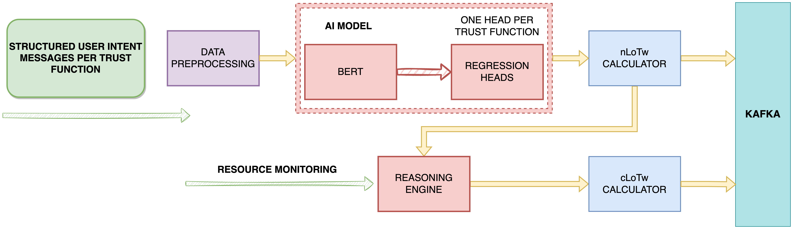

# 🧠 SAFE-6G Cognitive Coordinator (CoCo)

The **Cognitive Coordinator (CoCo)** is the AI-native trust orchestrator at the heart of the **SAFE-6G architecture**. It interprets user trust intents expressed in natural language and translates them into actionable system configurations, dynamically computing a **Level of Trustworthiness (LoT)** that aligns with both semantic intent and real-world resource constraints.



## ✅ Key Features

- Fine-tuned **BERT regressor** with five output heads, one per Trust Function (TF)
- Fully interpretable scoring pipeline with **semantic weighting**
- **Calibrated trust scoring** based on available system resources
- FastAPI-based HTTP interface for input submission and LoT computation
- **Dockerized** deployment for seamless integration into SAFE-6G testbed environments
- Plug-and-play design with message broker, monitoring, and orchestrator compatibility

## 🧮 Trustworthiness Model

### 1. 🔎 Trust Function Weighting

Let $n_{TF_j}$ be the number of user input expressions mapped to trust function $TF_j$. A logarithmic smoothing function assigns importance weights:

$$
W_{TF_j} = \frac{\log(1 + n_{TF_j})}{\sum_{k=1}^{5} \log(1 + n_{TF_k})}
$$

---

### 2. 📊 Non-Calibrated Level of Trustworthiness (nLoTW)

Given BERT-predicted scores $REG_{TF_j} \in [0, 100]$, the initial semantic-level trust score is:

$$
nLoTW = \left( \frac{\sum_{j=1}^{5} W_{TF_j} \cdot REG_{TF_j}}{\sum_{j=1}^{5} W_{TF_j}} \right) \cdot 100
$$

---

### 3. 🧠 Calibrated Level of Trustworthiness (cLoTW)

Each TF has a maximum enforceable capacity $TFcap_j \in [0, 100]$. The calibrated score is:

$$
V_j = \min(W_{TF_j} \cdot REG_{TF_j}, TFcap_j)
$$

$$
cLoTW = \left( \frac{\sum_{j=1}^{5} V_j}{\sum_{j=1}^{5} V_j} \right) \cdot 100
$$


## 🚀 Getting Started

### 1. Model Setup

Save the pretrained BERT regressor file to the following path:

```

storage/model/bert\_model.pth

````

### 2. Run the System

Launch the CoCo API and its core services via Docker:

```bash
docker compose up --build
````

## 📡 API Usage

### 1. Submit Trust-Labeled Data

Submit input sentences with labeled trust categories (e.g., "Privacy", "Security"):

```bash
curl -X POST http://localhost:8000/data/submit \
  -H "Content-Type: application/json" \
  -d '{
    "data": [
      { "label": "Privacy", "text": "Users should control access to their data." },
      { "label": "Security", "text": "All communications must be encrypted." },
      { "label": "Reliability", "text": "Service uptime must exceed 99.999%." }
    ]
  }'
```

### 2. Compute Trust Scores

Trigger the trustworthiness computation once data has been submitted:

```bash
curl -X POST http://localhost:8000/lotw/calculate
```

The response will include:

* `nLoTW`: Non-calibrated score based on intent
* `cLoTW`: Calibrated score constrained by system resources
* Per-TF breakdown: weights, predicted scores, and applied caps

## 📚 Architecture Overview

* **NLP + Regression**: BERT-based sentence encoder with 5 specialized regression heads
* **Reasoning Engine**: Applies resource-awareness to compute feasible trust levels
* **Orchestrator Integration**: Uses a broker-based publish/subscribe system for TF control
* **Monitoring & Feedback**: Supports closed-loop adjustments

## 🧾 Sample Data Set (Excerpt)

| Trust Function | Sample Input                                   |
| -------------- | ---------------------------------------------- |
| Privacy        | "Users should control access to their data."   |
| Security       | "All communications must be encrypted."        |
| Reliability    | "System uptime must exceed 99.999%."           |
| Resilience     | "System must continue operating under attack." |
| Safety         | "The system must protect against user harm."   |


